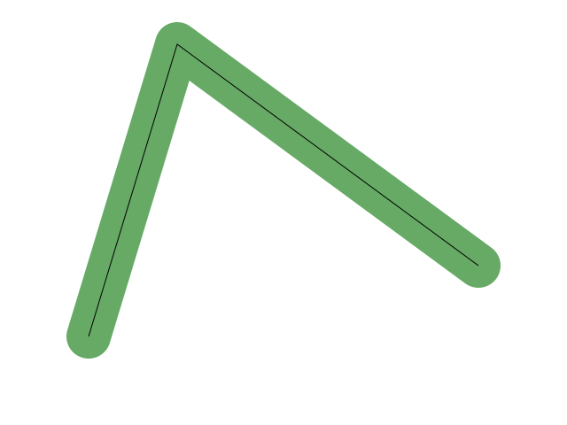

Shapes are at the heart of 2D graphics. All user interfaces are built on a foundation of rectangles, a simple but important shape. Text rendering is composed of glyphs, each of which is a shape on its own. And of course filled and stroked shapes are important in vector illustration applications as well as charts and other data visualization.

At its most general and abstract, a shape is a function from a point on the plane to a Boolean indicating whether the point is in the interior of the shape, so mathematically can be represented as $$\boldsymbol{R}^2 \rightarrow \{0, 1\}$$.

As a particularly simple example, the circle centered at $$(x_0, y_0)$$ with radius $$r$$ can be represented with the following predicate:

$$
(x - x_0)^2 + (y - y_0)^2 \leq r^2
$$

It's even simpler when using vector notation rather than writing out individual coordinates:

$$
|\boldsymbol{x} - \boldsymbol{x}_0|^2 \leq r^2
$$

Most commonly, though, in 2D graphics, shapes are represented as *paths.* A point is on the interior of a filled path when its winding number is either nonzero or odd, depending on the fill rule. A path can also be stroked, basically the result of drawing a pen with a given radius along the path, though there are subtleties.

## Paths

A path is represented as a sequence of path segments. Each path segment is most commonly represented as a parametric curve $$(x(t), y(t))$$ or $$\boldsymbol{x}(t)$$, with the parameter $$t$$ conventionally ranging from $$[0..1]$$.

The simplest curve segment is a line, which is represented a pair of points $$(\boldsymbol{x}_0,\boldsymbol{x_1})$$. Then the formula is:

$$
\boldsymbol{x}(t) = (1 - t)\boldsymbol{x}_0 + t\boldsymbol{x}_1
$$

Paths consisting entirely of line segments are common, and are called *polylines.* For curves, there are choices of curve representations. The most common are definitely Bézier curves, though many systems also admit other primitives such as circular or elliptical arcs.

A quadratic Bézier is represented as three points, and its parametric formula is:

$$
\boldsymbol{x}(t) = (1 - t)^2\boldsymbol{x}_0 + 2(1-t)t\boldsymbol{x}_1 + t^2\boldsymbol{x}_2
$$

Similarly, a cubic Bézier is defined as:

$$
\boldsymbol{x}(t) = (1 - t)^3\boldsymbol{x}_0 + 3(1-t)^2t\boldsymbol{x}_1 + 3(1-t)t^2\boldsymbol{x}_2 + t^3\boldsymbol{x}_3
$$

The general equation for an order $n$ Bézier is:

$$
\boldsymbol{x}(t) = \sum_{i=0}^n \binom{n}{i} (1 - t)^{n - i} t^i \boldsymbol{x}_i
$$

However, orders greater than 3 are rarely used. Note that $$\boldsymbol{x}(0) = \boldsymbol{x}_0$$ and $$\boldsymbol{x}(1) = \boldsymbol{x}_n$$. The points $$\boldsymbol{x}_i$$ where $$1 \leq i < n$$ are called *control points* or sometimes *off-curve points.* The endpoints are, of course, *on-curve points.*

Bézier curves have many advantages for 2D graphics. One special strength is that they are closed under affine transformation - the affine transform of a Bézier curve is the affine transformation of each of its points.

### Winding number

How do we determine whether a point is on the inside or outside of a closed path? The systematic way is in terms of the *winding number* of the curve with respect to the point.

For winding number to be meaningful, the path must be a sequence of closed subpaths. For a subpath to be closed, the end point of each segment must coincide with the start point of the next (in cyclic order, so the "next" segment after the last in a subpath is the fist in the subpath).

Thus, the subpath taken as a whole is $G0$ continuous. It can be rewritten in polar coordinates, $$r(t), \theta(t)$$, where $$0 \leq t \leq n$$. Here is is convenient to take $$n$$, the number of segments in the subpath, as the upper bound for $$t$$, so the $$t$$ parameter for any segment is simply the fractional part.

Then, the winding number is:

$$
\frac{\theta(n) - \theta(0)}{2\pi}
$$

<!-- \tau? -->

In a y-up coordinate system, anticlockwise rotation is considered a positive winding number, with clockwise negative. Since y-down is more common in graphics, we'll use the opposite convention, so clockwise is positive, and this will let use use the same math.

Winding numbers are closely related to contour integrals, and a more direct definition is as follows:

$$
\frac{1}{2\pi} \oint_C \,\frac{(\boldsymbol{x}(t) - \boldsymbol{x}_0) \times \boldsymbol{x}'(t)}{|\boldsymbol{x}(t) - \boldsymbol{x}_0|^2}\,dt
$$

<!-- sum of contributions from segments? -->

<!-- not liking the overloading of _0 here -->

#### Ray casting

While the contour integral formulation is a fine mathematical definition, it is not particularly easy or efficient to calculate directly. For that, *ray casting* is a better technique.

The essence of the technique is to cast a ray from $$(-\infty, y)$$ to $$(x, y)$$ and count all crossings with the path. In a y-down coordinate system, any crossing with the path going upward, in other words $$dy/dt < 0$$ counts as +1, and downward counts as -1.

This technique is more efficient, but requires some care with edge conditions. Here is the more detailed algorithm for line segments.

The total winding number is simply the sum of the contribution from each segment.

The first step is to reject the segment based on $$y$$. More precisely, the segment is rejected if $$y < \min(y_0, y_1)$$ or $$y \geq \max(y_0, y_1)$$, in which case its winding number contribution is 0. Note that the edge cases are carefully constructed so that a ray through a closed path always has an even number of crossings. In addition, horizontal line segments are rejected.

Then the line segment is solved for $$x$$ given $$y$$. There is a winding number contribution if $$x$$ is to the right of the line:

$$
x > x_0 + (y - y_0)\frac{x_1 - x_0}{y_1 - y_0}
$$

In that case, the winding number contribution is $$\text{signum}(y_0 - y_1)$$.

The technique generalizes to curves. The curve segment is split into y-monotonic subsegments, then for each subsegment the same technique is used, solving the curve for $$x$$ given $$y$$.

* [A Primer on Bézier Curves](https://pomax.github.io/bezierinfo/)
* Winding number
  - Mathematical interpretation
  - Even/odd and nonzero winding number rules

## Stroking

The two main ways that paths become images are filling, discussed above, and stroking. Informally, stroking can be understood as sweeping a pen, with some thickness, along the stroke. Unlike filling, which is well defined (winding number rule is the only relevant parameter other than the path itself), there is considerable variation in stroking, both in *stroke style* and in variations among implementations. On the other hand, while filling requires closed paths, stroking works for open paths as well.

There is no single clear mathematical definition of stroking. Existing systems tend to be defined by their implementations, though there are efforts to define it more systematically. There are (at least) three relevant definitions: Minkowski sum, swept line, and offset curve.

### Minkowski sum

The mathematically simplest form of stroking can be expressed as the Minkowski sum of a disc with the set of points on the path. Expanding that out, the predicate can be written:

$$
\exists\, i, t: |\text{path}[i](t) - \boldsymbol{x}| < r
$$

This style of stroking is certainly simplest from the mathematical perspective, but is not generally the default or the most common. It results in strokes with round ends, and round joins at angled corners, the outline defined by circular arcs.

One advantage of the Minkowski sum formuation is that it generalizes to other pen shapes than a circle. For example, affine transformation of a stroked outline is equivalent to stroking the affine transformed source path with an elliptical pen.

### Stroke styles

In the base set, caps are round, butt, and square, and joins are round, miter, and bevel. Traditionally, there is also "miter limit" setting, so that if the angle is more acute than the limit, the join is bevel, otherwise miter.

TODO: show examples. In the meantime, [MDN tutorial](https://developer.mozilla.org/en-US/docs/Web/SVG/Tutorial/Fills_and_Strokes) is a reasonable source.

The [SVG 2 draft spec] proposes additional styles, but these are not in widespread use.

### Swept line

The main limitation of the Minkowski sum approach is that it can only express round ends and joins, while designers prefer a wider range of styles. These other styles are generally expressed as the stroke of each continuous path segment, plus additional elements applied to the ends and joins at corners.

The stroke of a single continuous curve segment is defined by sweeping a line along the path, centered on that path, and normal to it.

In general, when round caps and joins are specified, the swept line definition is equivalent to Minkowski sum, but as [Nehab 2020] points out, there is one edge case, namely a cubic Bézier containing a cusp, where the swept line definition gives a flat cap.

When paths have extremes of curvature, the outline can have complex shapes, defined in [Nehab 2020] as evolutes. Computing these shapes is nontrivial.

The [SVG 2 draft spec] is defined in terms of swept line. That said, it is rare for implementations to rigorously follow this spec.

### Offset curves

A third definition is offset curves, otherwise known as parallel curves. Swept along a continuous curve, a line normal to that curve traces a parallel curve offset by the half-width of the line in either direction. Joins can be defined by stitching together the endpoints of these parallel curves, with additional path segments for the different join types (TODO: be more precise). Butt caps can be defined as drawing line segments from the endpoints.

The main motivation for this definition is to enable performant implementations. Efficient algorithms for parallel curve are known, but not so much for the evolutes as defined in [Nehab 2020].

For paths that do not have extremes of curvature (relative to the line width), the results are the same as the swept line definition.

When authoring vector content, it is best not to depend on handling of these edge cases, as implementations may vary. One way to achieve robustness is to specify round joins and caps. Another is to avoid excessive curvature, or, failing that, perform stroke to fill expansion during authoring.

TODO: another challenge in computing offset curves is the presence of cusps.

At the time of writing, the popular Skia library renders strokes consistent with the offset curve definition.

#### Computation of offset curves

There is a large literature on computing offset curves, as there are applications in computer aided design and manufacturing, path planning in robotics, and other domains. Yet, quality implementions are elusive.

[Tiller and Hanson] is commonly cited and frequently implemented, but its results for cubic Béziers are poor. In fact, they have only $$O(n^2)$$ scaling. The results for quadratic Béziers are better, with $$O(n^4)$$ scaling, and discerning implementors (including [Nehab 2020]) often use the quadratic version.

A new algorithm based on quartic curve fitting is given in [Parallel curves of cubic Béziers]. This algorithm as $$O(n^6)$$ scaling, good robustness, and good performance. It may not be as suitable for implementation on GPU, as it relies on recursive subdivision for finding cusps, and the quartic solver may be difficult to adapt to 32 bit floating point precision while retaining good numerical robustness. Another choice is to use [Euler spirals][Cleaner parallel curves with Euler spirals].

### Dashing

Another optional variation on style is *dashing.*

Note that determining the parameter $$t$$ for the start and end of each dash is an inverse arc length problem.

<!-- If we're going to use this pseudo-programming notation, do the same for winding number / filling. Ie write out the sum -->

## References

* Nehab 2020: [Converting stroked primitives to filled primitives][Nehab 2020]
* Kilgard 2020: [Polar Stroking][Kilgard 2020]
* [Parallel curves of cubic Béziers]
* [Cleaner parallel curves with Euler spirals]
* Tiller and Hanson: [Offsets of Two-Dimensional Profiles][Tiller and Hanson]
* [Shader-Based Antialiased, Dashed, Stroked Polylines]

[Kilgard 2020]: https://arxiv.org/abs/2007.00308
[Nehab 2020]: http://w3.impa.br/~diego/projects/Neh20/
[Shader-Based Antialiased, Dashed, Stroked Polylines]: https://jcgt.org/published/0002/02/08/paper.pdf
[SVG 2 draft spec]: https://www.w3.org/TR/SVG2/
[Tiller and Hanson]: https://ieeexplore.ieee.org/iel5/38/4055906/04055919
[Cleaner parallel curves with Euler spirals]: https://raphlinus.github.io/curves/2021/02/19/parallel-curves.html
[Parallel curves of cubic Béziers]: https://raphlinus.github.io/curves/2022/09/09/parallel-beziers.html
